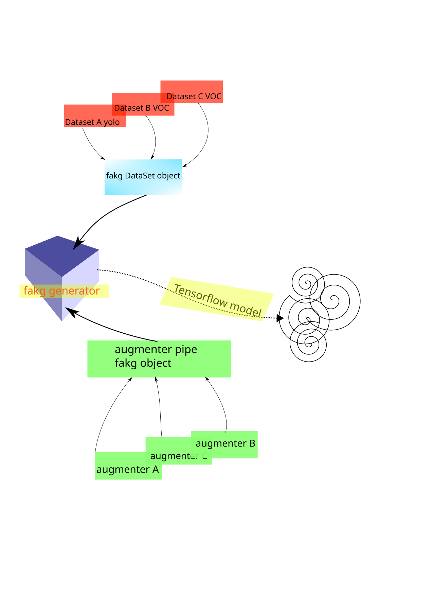
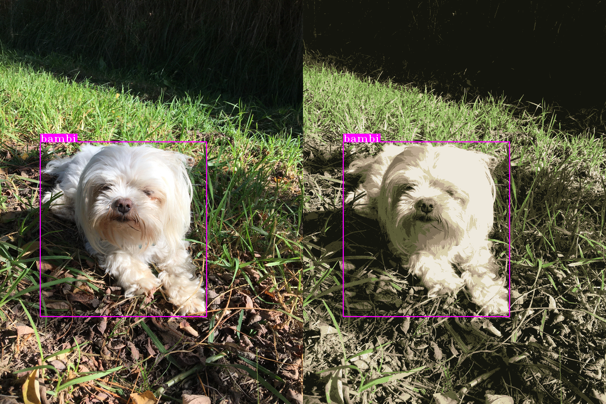
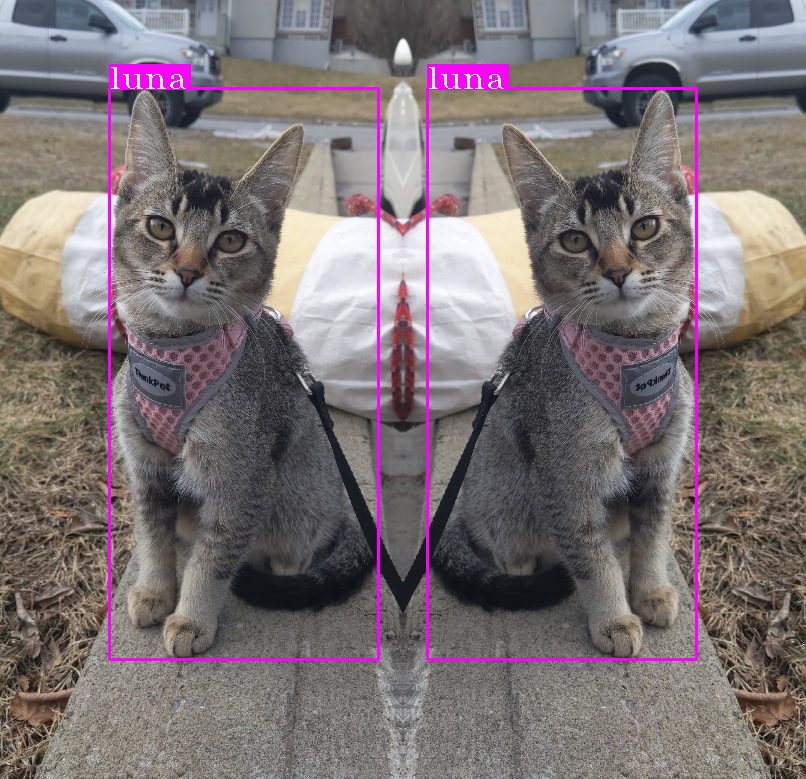
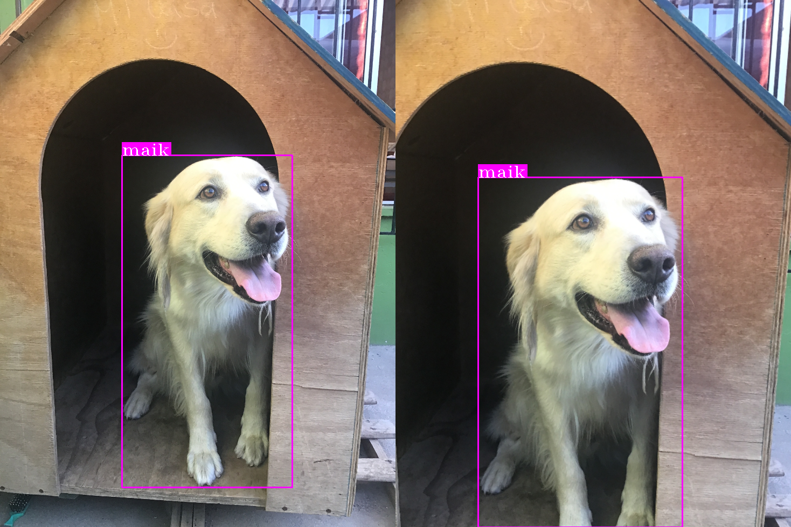
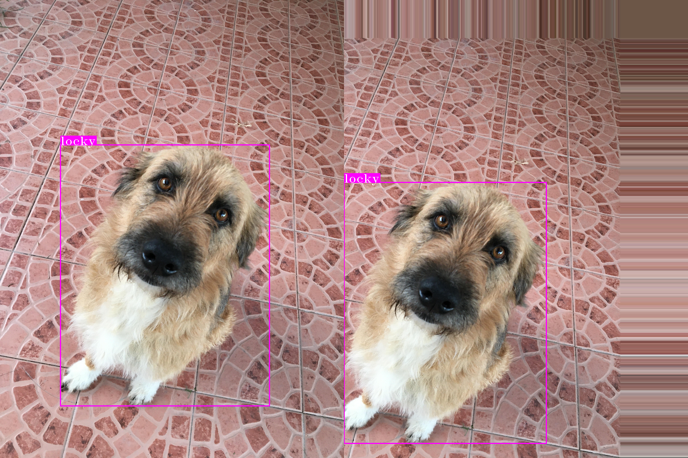
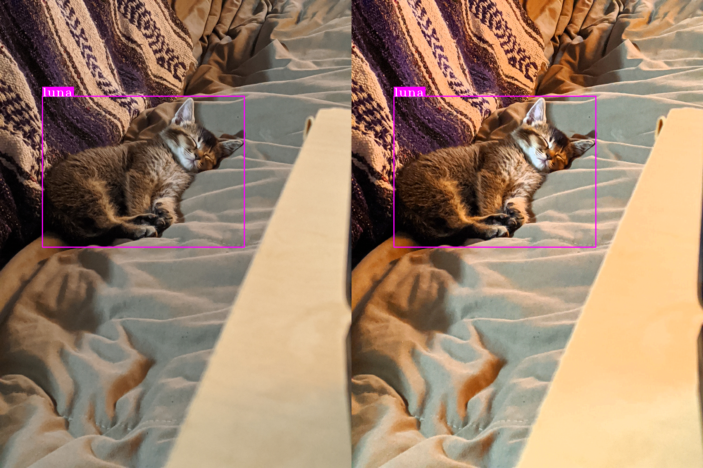
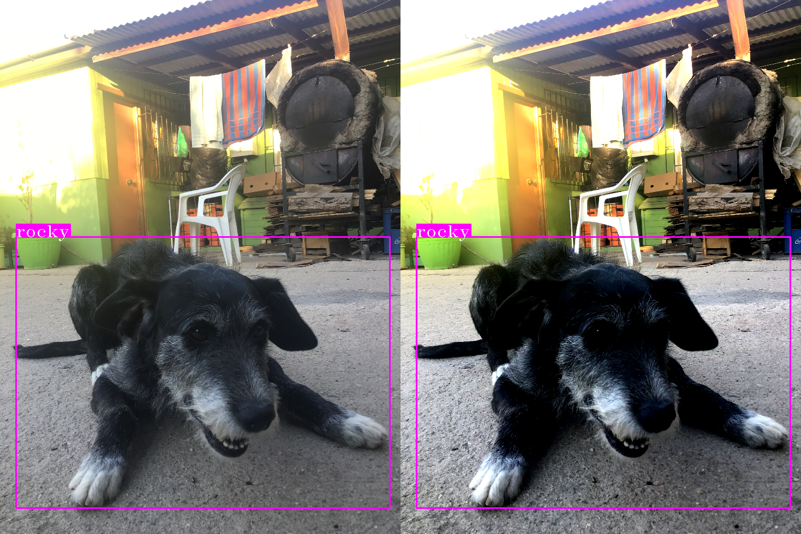
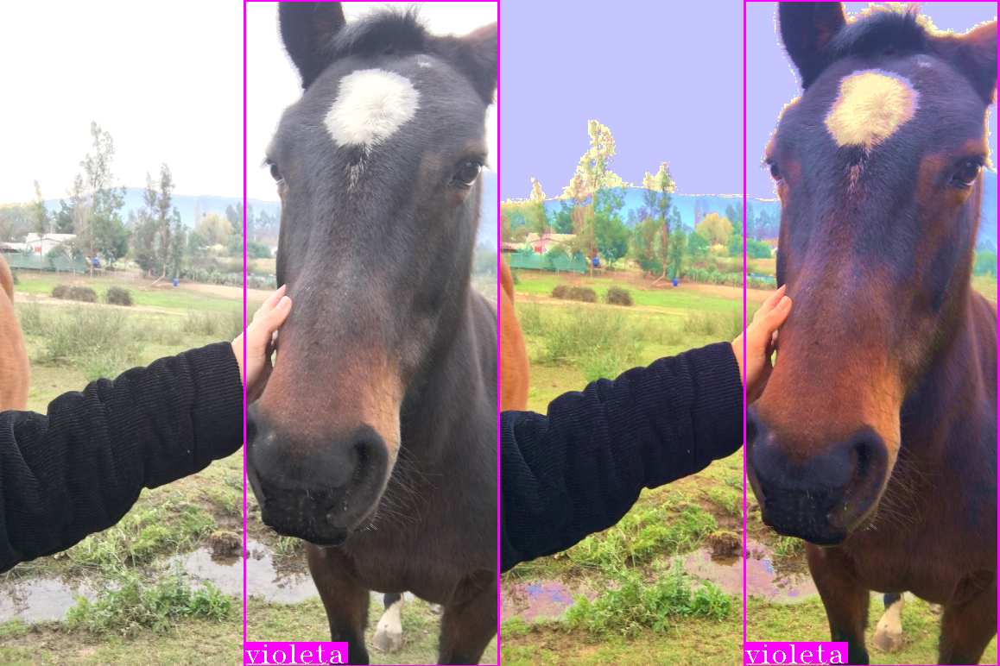

# The FAKG library
 "**F**ucking **A**wesome **K**eras **G**enerators" is a library of datageneratos for *deep learning* with data augmentation methotds and many features to work with datasets, like join together several datasets in different formats (yolo, voc, etc) **in just one generator!** and many others.
 
The goal of this work, is that it allows you to reduce long hours of work programming boring things, and go quickly to the fun part in machine learning, which is to experiment with things, and automate other stuf that implies irrelevant work. this library are maded with in mind  to work in jupyter lab notebooks, google colab, sagemaker and so on. Note tath to find it useful, you must import it and use it as part of your projects, by itself it is not useful. Think about fakg is like a stronger toolbox to face technical deeplearning problems.

With love, Cesar.

***
Fakg help us in three ways, the first one is dataset problems (lecture decode, study and transform), the second one is in generator objects for training ours models maded in Tensorflow/keras and third one are in augmentation data stage in traingin work.
The next schema show how fakg works,

## fakg "DataSet"

Often we face a lot of problems in Deep learning in Dataset stage, poor data, o multiple dataset with diferent formats. For this task is designed DataSet's fakg object. it allow join a lot of dataset together in diferent formats, export it to pandas DataFrame for study or save it for later problems, plot examples, define batch size, chose classes in object clasification or detection (if you don't want train all of your objects/classes) and more.

## fakg augmenters (ImageLayers)

faking includes data augmentation methods within its modules, for now only object detection, video classification and image classification are implemented, here some examples,
**CutOut**

**KMeansCC**

**Hflip**

**Vflip**

**GaussianFlitering**

**RandomCrop**

**RandomRotation**

**RandomShear**

**RandomShift**

**BrightnessJitter**

**ContrastJitter**

**SaturationJitter**

**Many thanks to the people who together with their pets supported the creation of this small dataset**

- Alison Aliaga
 - Milo

- Claudia Acevedo
 - Black
 - peppa
 - locky
 - bambi
 - violeta

- Camila Olivares
 - Luna
    
- Joaquin Rohland
 - Rocky
 - Maik 